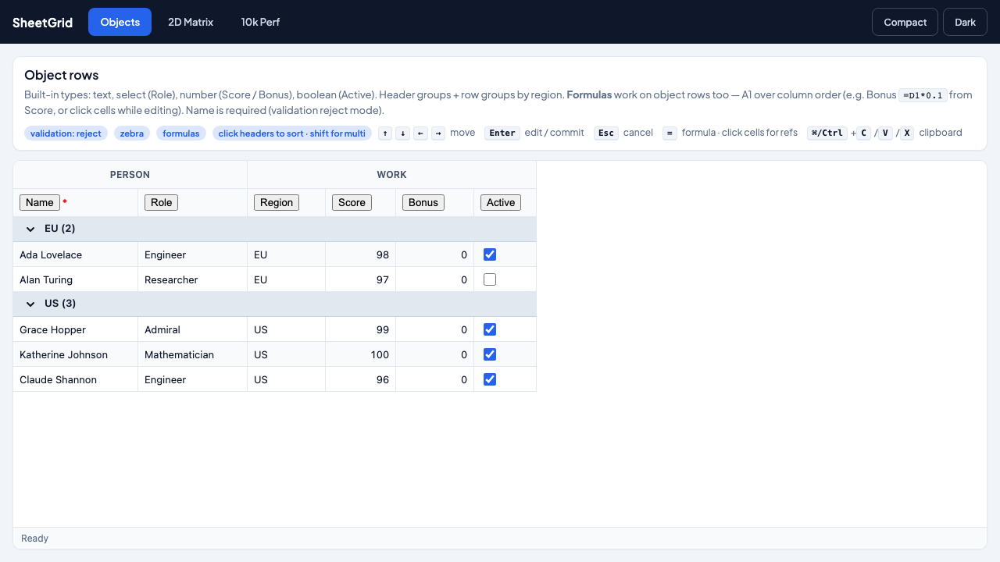
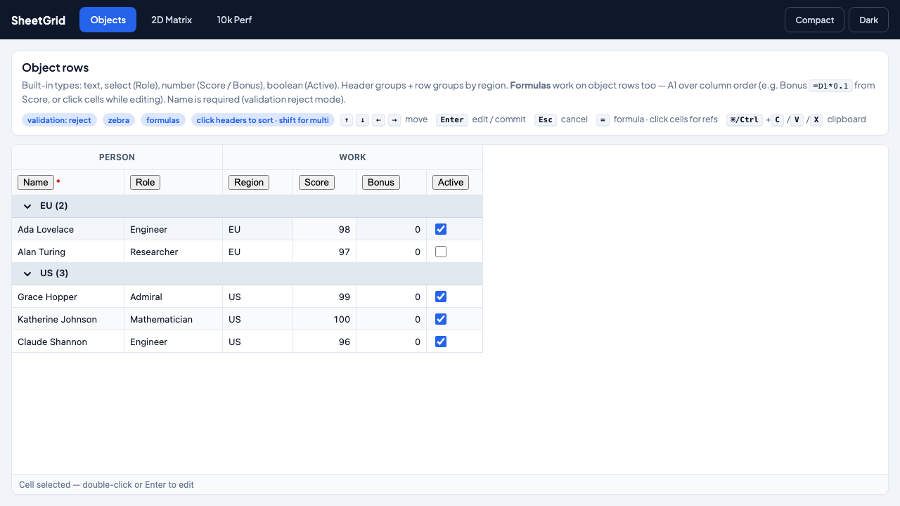
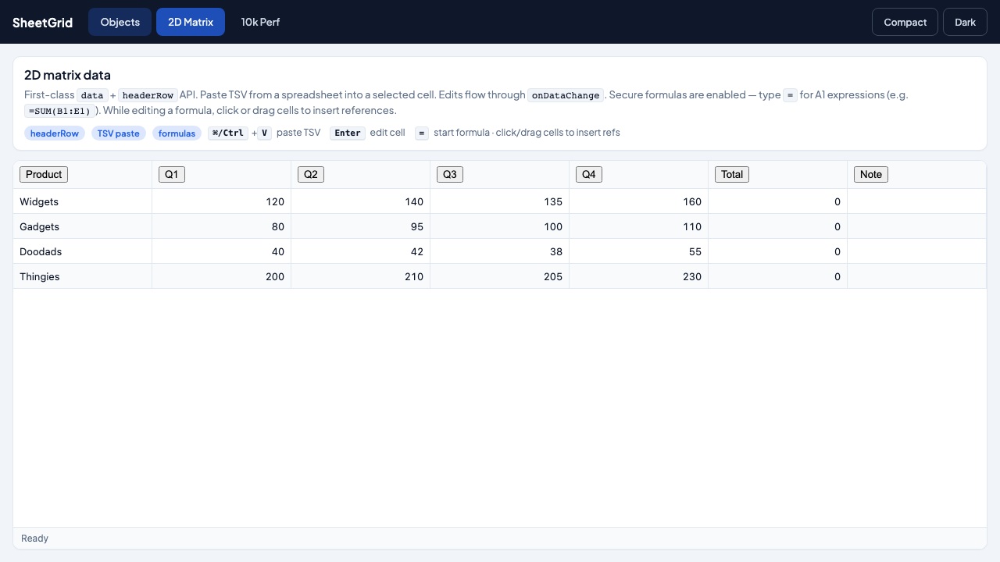
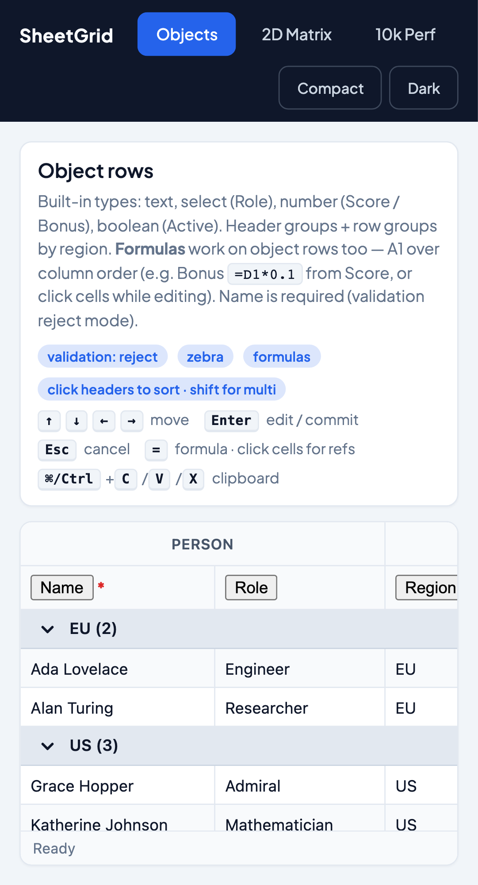

# SheetGrid

**Excel-class data grid for React and Vue** — virtualized, customizable, container-responsive. Built from scratch for developer experience.

> Independent monorepo at `sheetgrid/`. Not part of canvas-lib / Ananse.

[](https://github.com/pkdadson/sheetgrid/actions/workflows/ci.yml)
[](https://www.npmjs.com/package/@sheetgrid/react)
[](https://www.npmjs.com/package/@sheetgrid/vue)
[](https://www.npmjs.com/package/@sheetgrid/nuxt)
[](LICENSE)

Published releases are gated on a green CI run (build, unit tests, and Playwright e2e). Local npm publish: `pnpm publish:npm` (refuses if CI is red).

## Preview

<p align="center">
  
</p>

| Objects (detail) | 2D Matrix | Mobile |
|---|---|---|
|  |  |  |

## Why SheetGrid

| Need | What you get |
|------|----------------|
| Install & render | `@sheetgrid/react` or `@sheetgrid/vue@next` — same features, framework-idiomatic API |
| Scale | DOM virtualization for **rows and columns** (demo: 10k×100) |
| Excel feel | Selection, keyboard, edit, TSV clipboard, resize, column reorder |
| Customize | Cell types, validators, `registerCellType`, CSS variable themes |
| Data shapes | **First-class** object rows **and** 2D matrices |
| SSR / Nuxt | Vue package is SSR-safe; `@sheetgrid/nuxt` module auto-imports composables |

## Install

**React**

```bash
pnpm add @sheetgrid/react
# npm i @sheetgrid/react
```

Peers: `react`, `react-dom` ≥ 18.2 (React 19 supported).

**Try live in StackBlitz** → [stackblitz.com/github/pkdadson/sheetgrid/tree/main/starters/react-vite](https://stackblitz.com/github/pkdadson/sheetgrid/tree/main/starters/react-vite) — opens a Vite + React 18 project with `@sheetgrid/react@^0.2.0` from npm, no local install needed.

**Vue 3** (alpha)

```bash
pnpm add @sheetgrid/vue@next
# npm i @sheetgrid/vue@next
```

Peers: `vue` ≥ 3.3. Nuxt 3 users also `pnpm add @sheetgrid/nuxt@next` and add it to `modules` in `nuxt.config.ts`.

**Try live in StackBlitz** → [stackblitz.com/github/pkdadson/sheetgrid/tree/main/starters/vue-vite](https://stackblitz.com/github/pkdadson/sheetgrid/tree/main/starters/vue-vite) — opens a Vite + Vue 3 project with `@sheetgrid/vue@next` from npm, no local install needed.

`@sheetgrid/core` and `@sheetgrid/tokens` install as transitive dependencies in both.

## Quickstart — objects

**React**

```tsx
import { Grid } from "@sheetgrid/react";

export function App() {
  return (
    <div style={{ height: 400 }}>
      <Grid
        rows={[
          { id: "1", name: "Ada", age: 36 },
          { id: "2", name: "Grace", age: 40 },
        ]}
        columns={[
          { id: "name", header: "Name" },
          { id: "age", header: "Age", type: "number" },
        ]}
      />
    </div>
  );
}
```

**Vue 3**

```vue
<script setup lang="ts">
import { SheetGrid } from "@sheetgrid/vue";

const rows = [
  { id: "1", name: "Ada", age: 36 },
  { id: "2", name: "Grace", age: 40 },
];
const columns = [
  { id: "name", header: "Name" },
  { id: "age", header: "Age", type: "number" as const },
];
</script>

<template>
  <div style="height: 400px">
    <SheetGrid :rows="rows" :columns="columns" />
  </div>
</template>
```

## Quickstart — 2D data

**React**

```tsx
import { Grid } from "@sheetgrid/react";

<Grid
  data={[
    ["Name", "Age"],
    ["Ada", 36],
  ]}
  headerRow
  onDataChange={(next) => console.log(next)}
  style={{ height: 400 }}
/>
```

**Vue 3**

```vue
<SheetGrid
  :data="[['Name', 'Age'], ['Ada', 36]]"
  header-row
  @data-change="(next) => console.log(next)"
/>
```

Row and column virtualization is built into `<Grid />` (React) and `<SheetGrid>` (Vue) for both object rows and 2D matrices.

### Keep your own table (still virtualize)

Already have a `<table>` (or custom grid) and only need windowing? Use **`useVirtualWindow`** — works with **object rows or 2D JSON** (`data[r][c]`). SheetGrid does not replace your markup.

```tsx
import { useRef } from "react";
import { useVirtualWindow } from "@sheetgrid/react";

function MatrixTable({ data }: { data: unknown[][] }) {
  const scrollerRef = useRef<HTMLDivElement>(null);
  const colCount = data[0]?.length ?? 0;

  const v = useVirtualWindow({
    count: data.length,
    getItemKey: (i) => String(i),
    estimateSize: () => 32,
    getScrollElement: () => scrollerRef.current,
  });

  return (
    <div ref={scrollerRef} style={{ height: 400, overflow: "auto" }}>
      <table>
        <tbody>
          {v.padStart > 0 && (
            <tr aria-hidden style={{ height: v.padStart }}>
              <td colSpan={colCount} style={{ padding: 0, border: 0 }} />
            </tr>
          )}
          {v.virtualItems.map((item) => (
            <tr key={item.key} data-index={item.index} ref={v.measureElement}>
              {data[item.index]!.map((cell, c) => (
                <td key={c}>{String(cell ?? "")}</td>
              ))}
            </tr>
          ))}
          {v.padEnd > 0 && (
            <tr aria-hidden style={{ height: v.padEnd }}>
              <td colSpan={colCount} style={{ padding: 0, border: 0 }} />
            </tr>
          )}
        </tbody>
      </table>
    </div>
  );
}
```

Full contract (spacers, measure ref, `pinKeys` for menus): [Bring your own table](docs/recipes/11-bring-your-own-table.md).

### Vue

Vue 3 users get `<SheetGrid>` and the `useVirtualWindow` composable via **`@sheetgrid/vue`** (alpha). Same behavior as the React `<Grid>` — object rows or 2D matrix, virtualized rows + columns, selection, keyboard nav, TSV clipboard, editable cells (text / number / boolean / select), sort, column groups, opt-in formulas.

```vue
<script setup lang="ts">
import { SheetGrid } from "@sheetgrid/vue";

const rows = [
  { id: "1", name: "Ada", age: 36, active: true },
  { id: "2", name: "Grace", age: 40, active: false },
];
const columns = [
  { id: "name", header: "Name" },
  { id: "age", header: "Age", type: "number" as const },
  { id: "active", header: "Active", type: "boolean" as const },
];
</script>

<template>
  <SheetGrid :rows="rows" :columns="columns" />
</template>
```

Nuxt 3 users add **`@sheetgrid/nuxt`** to `modules` in `nuxt.config.ts` for auto-imports and global component registration. See [`packages/vue/README.md`](packages/vue/README.md) for the full API.

Bring-your-own-table use case still available via `useVirtualWindow` — see [Recipe 11](docs/recipes/11-bring-your-own-table.md).

## Features

- Virtualized body rows **and** columns (DOM)
- Object rows + 2D matrix inputs
- Cell selection (click, shift, ctrl/cmd), keyboard navigation
- Inline edit + validation (`reject` / `commit-with-error`)
- Built-in validators: `required`, `number`, `min`, `max`, `pattern`
- Clipboard: Cmd/Ctrl+C / X / V (TSV)
- Column resize and drag reorder
- Column header groups + row grouping
- Click-to-sort headers, shift+click multi-column, custom per-column comparators
- Built-in cell types: `text`, `number`, `boolean`, `select`
- `registerCellType` + custom cell/editor props
- Theme tokens (CSS variables, density)
- Opt-in **formulas** (`formulas` prop): secure AST engine, A1 refs, full pure function catalog

## Demo

```bash
cd sheetgrid
pnpm install
pnpm dev:demo       # React — http://localhost:5177
pnpm dev:demo-vue   # Vue    — http://localhost:5178
```

Both demos ship the same three views:

- **Objects** — types, groups, validation
- **2D Matrix** — matrix API + paste
- **10k Perf** — row × column virtualization playground

## Documentation

| Doc | Description |
|-----|-------------|
| **[Docs index](docs/README.md)** | Full map of guides + recipes |
| [API reference](docs/api.md) | All `<Grid>` (React) and `<SheetGrid>` (Vue) props, columns, validators, exports |
| [Keyboard & accessibility](docs/keyboard-a11y.md) | Shortcuts, ARIA, focus, testing |
| [FAQ & troubleshooting](docs/faq.md) | Height, IDs, controlled data, perf, SSR |
| [Core / headless guide](docs/core-guide.md) | `@sheetgrid/core` store & custom renderers |
| [Formula catalog](docs/formulas-catalog.md) | Complete function list, errors, limits |

### Recipes

1. [Install](docs/recipes/01-install.md)
2. [Row objects](docs/recipes/02-row-objects.md)
3. [2D data](docs/recipes/03-2d-data.md)
4. [Built-in & custom cells](docs/recipes/04-custom-cell.md)
5. [Validation](docs/recipes/05-validation.md)
6. [Column & row groups](docs/recipes/06-groups.md)
7. [Reorder](docs/recipes/07-reorder.md)
8. [Theming](docs/recipes/08-theming.md)
9. [Formulas](docs/recipes/09-formulas.md)
10. [Sort](docs/recipes/10-sort.md)
11. [Bring your own table](docs/recipes/11-bring-your-own-table.md) — virtualize existing markup (objects or 2D JSON) without `<Grid />`

### AI / agentic apps

- [`@sheetgrid/agent`](packages/agent/README.md) — Give your app's agent a typed handle on the grid: `getSchema`, `setCell`, `undo`, `snapshot`, LLM tool descriptors. Works with `<Grid />` (React) and `<SheetGrid />` (Vue).

## Packages

| Package | Role |
|---------|------|
| [`@sheetgrid/react`](packages/react/README.md) | Public React `<Grid />` |
| [`@sheetgrid/vue`](packages/vue/README.md) | Vue 3 `<SheetGrid>` + `useVirtualWindow` (alpha) |
| [`@sheetgrid/nuxt`](packages/nuxt/README.md) | Nuxt 3 module (auto-imports + global registration) |
| [`@sheetgrid/agent`](packages/agent/README.md) | Framework-agnostic controller + LLM tool descriptors (alpha) |
| [`@sheetgrid/core`](packages/core/README.md) | Engine (also published; used by react/vue) |
| [`@sheetgrid/tokens`](packages/tokens/README.md) | CSS variables |

## Develop

```bash
pnpm install
pnpm test            # unit (vitest)
pnpm build
pnpm dev:demo
pnpm exec playwright install chromium   # once
pnpm test:e2e        # Playwright UI/UX against demo
pnpm publish:check   # test + build + npm dry-run
```

## Publishing (maintainers)

1. Ensure `pnpm publish:check` passes  
2. Log in to npm (`npm login`) with access to the `@sheetgrid` scope  
3. Publish in dependency order:

```bash
# Stable
pnpm --filter @sheetgrid/tokens publish --access public
pnpm --filter @sheetgrid/core publish --access public
pnpm --filter @sheetgrid/react publish --access public

# Alpha (Vue port + Nuxt module) — published under the `next` dist-tag
pnpm --filter @sheetgrid/vue publish --tag next --access public
pnpm --filter @sheetgrid/nuxt publish --tag next --access public
```

Or use changesets / a release script when the repo is on GitHub.

Versions:
- `@sheetgrid/react`, `@sheetgrid/core`, `@sheetgrid/tokens` — stable `0.1.x`
- `@sheetgrid/vue`, `@sheetgrid/nuxt` — pre-release `0.1.0-alpha.x` under the `next` tag

## Roadmap

- Fill handle (v1.1)
- Multi-sheet (later)
- Canvas renderer (later)

## Contributing

See [CONTRIBUTING.md](CONTRIBUTING.md) for setup, PR flow, and testing.
Release notes live in [CHANGELOG.md](CHANGELOG.md).

## License

MIT — see [LICENSE](LICENSE)
