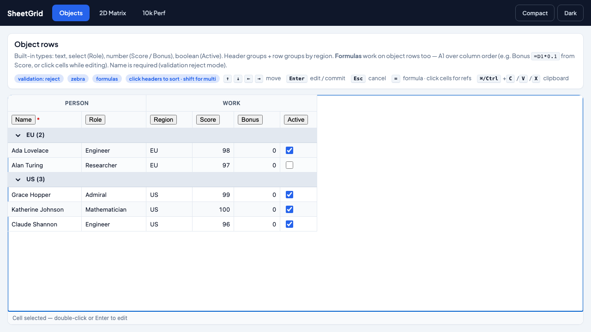

# Keyboard & accessibility

SheetGrid is keyboard-first for cell navigation and implements common spreadsheet shortcuts. The scroll root is focusable (`tabIndex={0}`) and exposes ARIA grid roles.

## Focus

1. Tab (or click) into the grid root — default `data-testid` is `sheetgrid`.
2. Arrow keys move the **active** cell.
3. Type to replace, or **F2** / **Enter** to edit the current value.
4. While editing, focus is inside the editor control (not the grid root).

Give the grid (or its parent) a height so the virtualized viewport is visible.



## Keyboard shortcuts

### Navigation (not editing)

| Key | Action |
|-----|--------|
| `↑` `↓` `←` `→` | Move active cell |
| `Shift` + arrow | Extend selection range |
| `Home` / `End` | Move to first / last column in the row |
| `Tab` / `Shift+Tab` | Move right / left (does not leave the grid) |
| `Enter` | Start edit (keep current value) |
| `F2` | Start edit (keep current value) |
| Printable character / `Space` | Start edit and **replace** with that character |
| `Escape` | Cancel (navigation phase: no-op / clear pending) |
| `Cmd/Ctrl+A` | Select all |
| `Cmd/Ctrl+C` | Copy selection (TSV; formulas copy source when present) |
| `Cmd/Ctrl+X` | Cut selection |
| `Cmd/Ctrl+V` | Paste TSV into active / selection |

### Editing

| Key | Action |
|-----|--------|
| `Enter` | Commit |
| `Tab` | Commit (then navigation may move — see Grid behavior) |
| `Escape` | Cancel edit; restore previous value |
| `Blur` | Commit (subject to validation mode) |

### Mouse

| Action | Result |
|--------|--------|
| Click cell | Activate + select |
| Shift+click | Extend range |
| Ctrl/Cmd+click | Toggle cell in selection (multi) |
| Double-click cell | Start edit |
| Drag leaf header | Reorder column |
| Drag header right edge | Resize column |
| Click header (sortable) | Cycle sort: asc → desc → off |
| Shift+click header | Multi-column sort priority |
| Click group chevron | Expand / collapse row group |

### Formulas (when `formulas` is on)

| Action | Result |
|--------|--------|
| Type `=` … | Formula draft |
| Click another cell while draft starts with `=` | Insert A1 address (**point mode**) |
| Drag across cells in point mode | Insert A1 range |
| Enter | Commit formula |

## Clipboard format

- Copy/cut serialize the selection as **TSV** (`\t` columns, `\n` rows).
- Paste accepts TSV (and plain multi-line text via the same path).
- Paste runs per-cell validation; invalid cells follow `validationMode`.

Requires a secure context / permission for `navigator.clipboard` in some browsers; the grid also handles the `paste` event with `clipboardData` when available.

## ARIA & roles

| Element | Attributes |
|---------|------------|
| Scroll / focus root | `role="grid"`, `tabIndex={0}` |
| Header / body rows | `role="row"` |
| Leaf headers | `role="columnheader"`, `aria-sort` when sortable |
| Cells | `role="gridcell"`, `aria-selected` when selected, `aria-invalid` on error |
| Editors | `aria-invalid` when validation fails |
| Boolean cells | `role="checkbox"` with accessible name from column header |
| Row group toggle | `button` with `aria-expanded`, name like “Collapse group …” |
| Status bar | `role="status"`, `aria-live="polite"` (`data-testid` = `` `${gridTestId}-status` ``) |
| Spacers / chrome | `aria-hidden` where decorative |

Active cell is also marked with `data-active="true"` for styling and tests.

## Validation & a11y

- **`reject` (default):** invalid commit keeps the previous value; editor may stay open with `aria-invalid="true"`; status bar announces politely; Escape clears the draft and error chrome when appropriate.
- **`commit-with-error`:** value is written; cell keeps error state for form-style “save later” flows.

## Testing hooks

```tsx
<Grid data-testid="orders-grid" /* ... */ />
// Status: orders-grid-status
```

Useful queries:

- `getByRole("grid")`
- `getByRole("columnheader", { name: "…" })`
- `getByRole("gridcell")`
- `getByRole("checkbox", { name: "Active" })`
- `locator('[data-active="true"]')`
- `locator('td.eg-td[aria-invalid="true"]')`

## Screen readers

The grid renders standard ARIA `grid` / `row` / `columnheader` / `gridcell` roles, so VoiceOver and NVDA read it as a table. Practical guidance:

### VoiceOver (macOS)

- Enter Tables Mode with **VO + ⌘ + Y** (or auto-triggered on focus).
- **VO + arrow** moves the reading focus cell-by-cell. The grid's own arrow-key navigation still fires — one keystroke moves both.
- **VO + T** reads the current column header for context.
- **VO + R** reads the current row.
- Errors announce via the status region (`aria-live="polite"`), so validation messages come in after the cell content.

### NVDA (Windows)

- Focus the grid and press **NVDA + F5** to summarize the table.
- **Ctrl + Alt + arrows** reads cell-by-cell in table navigation mode.
- Set **speech > announcement of "invalid entry"** to hear `aria-invalid` cells.
- Status changes (validation, edit hint) are announced through `role="status"`.

### Testing tips

- Use `axe-core` or the browser's built-in accessibility inspector on the demo (`http://localhost:5177`) — it should flag zero violations for the golden path.
- Real AT testing beats automated checks. VoiceOver + Safari and NVDA + Firefox cover the most common assistive combos.
- Verify the sort direction is announced when you press **Enter** on a `columnheader` — `aria-sort` toggles between `ascending` / `descending` / `none`.

## Known limits

- Virtualization means off-screen cells are not in the DOM — prefer keyboard move / scroll-into-view of the active cell rather than querying every row.
- There is no full **row-header** / Excel-style row number chrome yet.
- **`aria-rowcount` / `aria-colcount` are not set on `role="grid"`.** For 10 000-row datasets, screen readers currently announce visible rows only, not "row 5 of 10 000". Tracked for a future release — for now, prefer named landmarks / a summary line for very large grids.
- Screen-reader depth is "grid + gridcell" smoke-level; complex multi-range selection is not fully announced as a single continuous region in all AT combos.
- Prefer visible labels via `header` (and `selectOptions` labels) so checkboxes and headers have names.

## Related

- [API reference](api.md)
- [FAQ](faq.md)
- [Validation recipe](recipes/05-validation.md)
