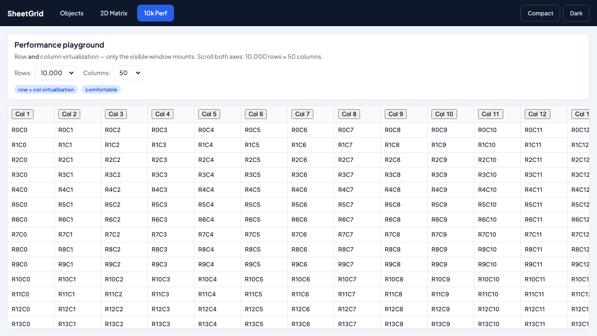
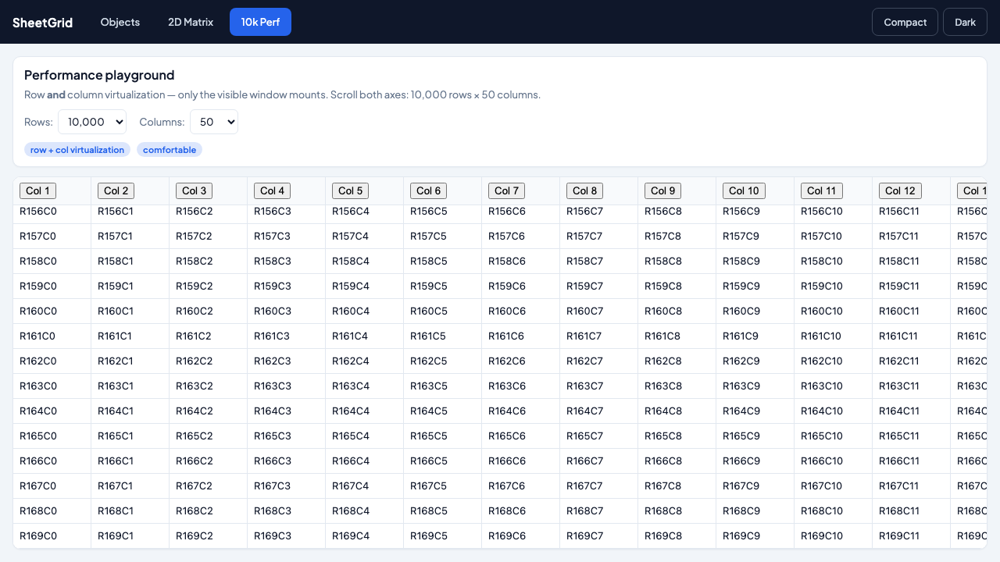

# Performance

SheetGrid virtualizes both rows and columns and keeps the DOM small. The `10k Perf` demo tab (10 000 rows × 50 columns) runs at ~60 fps on a mid-range laptop with ~270 cells in the DOM at any moment.

This page covers the knobs, the trade-offs, and how to measure.

## Try it

```bash
pnpm dev:demo   # http://localhost:5177
```

Open **10k Perf**. Resize the browser or change the `Rows`/`Columns` selectors. Only the visible window mounts — scroll and check DevTools → Elements to confirm.



After scrolling — only the newly visible rows are mounted:



## Knobs

### `overscan` (default `3`)

Extra rows/cols rendered outside the viewport in each direction. Higher is smoother during fast scrolls; lower keeps the DOM tighter.

```tsx
<Grid rows={rows} columns={cols} overscan={6} />
```

- **`3`** (default) — good balance for typical desks.
- **`6–10`** — smoother wheel scroll on macOS trackpads.
- **`1–2`** — minimize DOM on constrained devices; expect occasional white-flash on very fast scrolls.

### `virtualizeColumns` (default `true`)

Windows columns horizontally. Turn off only when you have **few columns** (say ≤ 20) and want simpler layout — e.g. all `width: "flex"` columns that must resize precisely against the viewport.

```tsx
<Grid rows={rows} columns={cols} virtualizeColumns={false} />
```

### `density` — `"compact"` shrinks row and header heights, letting more rows fit per viewport (`--eg-row-height: 28px`, `--eg-header-height: 30px`).

## Cell renderer cost

Every visible cell mounts your `cell` and `editor` components. Keep them light:

- **Prefer built-in types** (`text`, `number`, `boolean`, `select`) — they use pre-optimized renderers.
- Avoid heavy computation in `cell` — precompute in memoized derived state and pass primitives.
- Avoid inline object props (`cell={({ value }) => <MyThing data={{ ... }} />}`) — the `{ ... }` allocates every render.
- Memoize expensive custom cells with `React.memo` and stable props.

## Formulas

When `formulas` is on, the store rebuilds a dependency graph on each commit and recalcs dirty cells. Cost scales with:

- Total formula count.
- Range size (`A1:Z10000` reads a lot).
- Volatile functions (`RAND`, `NOW`, `TODAY`) — every recalc dirties them.

Tips:

- Tighten `formulaLimits.maxRangeCells` if you don't need giant ranges.
- Turn off `allowVolatile` for read-heavy sheets.
- Use `formulaEntry="explicit-only"` on untrusted paste paths — user text that starts with `=` stays text.

See [formulas-catalog → Safety limits](formulas-catalog.md#safety-limits-defaults) for every limit and default.

## Measuring

### FPS during scroll

```js
// Paste into DevTools with the grid visible.
const grid = document.querySelector('[role="grid"]');
let frames = 0;
const t0 = performance.now();
const loop = () => {
  frames++;
  if (performance.now() - t0 < 1000) requestAnimationFrame(loop);
  else console.log(`fps ≈ ${frames}`);
};
requestAnimationFrame(loop);
grid.scrollBy({ top: 5000, left: 500, behavior: "auto" });
```

Anything below ~55 fps is worth profiling.

### DOM node count

```js
document.querySelectorAll('[role="gridcell"]').length;
```

Should be roughly `visibleRows × visibleCols + overscan on both axes`. If it climbs into thousands, virtualization is off — check `virtualizeColumns` and container height.

### React profiler

Open React DevTools → Profiler and record a scroll. Cell components should re-render only when their **props** change. If they re-render every scroll frame, memoize.

## Common regressions

| Symptom | Likely cause |
|---------|--------------|
| Grid mounts thousands of cells | No definite height on the grid or parent; virtualization can't compute a window ([FAQ](faq.md#why-is-the-grid-blank--zero-height)) |
| Scroll janks after typing | Custom `cell` allocates new objects/functions each render — memoize |
| Formula edit locks the UI for 1–2 s | Recalc touched too many cells; tighten `maxRangeCells` or drop volatile |
| Column reorder feels sluggish | Column virtualization is off with a large column count — turn it on |
| First paint has no styles | Auto-inject runs in `useEffect` — for SSR, import `@sheetgrid/tokens/variables.css` directly ([FAQ → SSR](faq.md#ssr--nextjs)) |

## Bring-your-own table

If you keep your own markup, use `useVirtualWindow` instead of mounting thousands of rows. Same idea as the grid body: spacers + measured sizes, no transforms. See [recipe 11](recipes/11-bring-your-own-table.md).

## Related

- [FAQ — Performance](faq.md#performance)
- [API — `overscan`, `virtualizeColumns`](api.md#layout--grouping)
- [Formulas catalog — limits](formulas-catalog.md#safety-limits-defaults)
